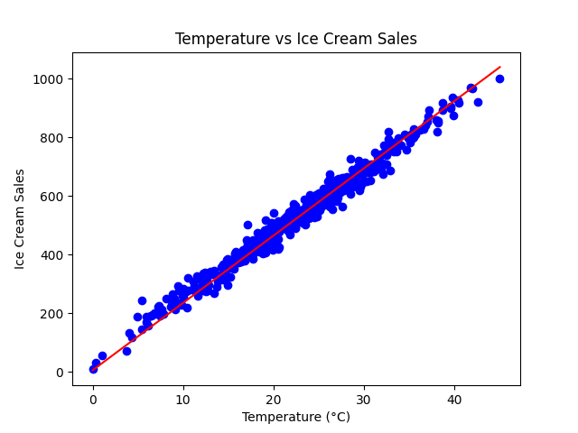
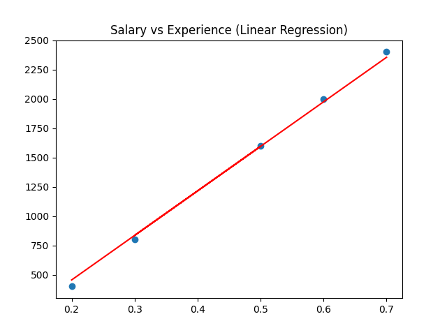
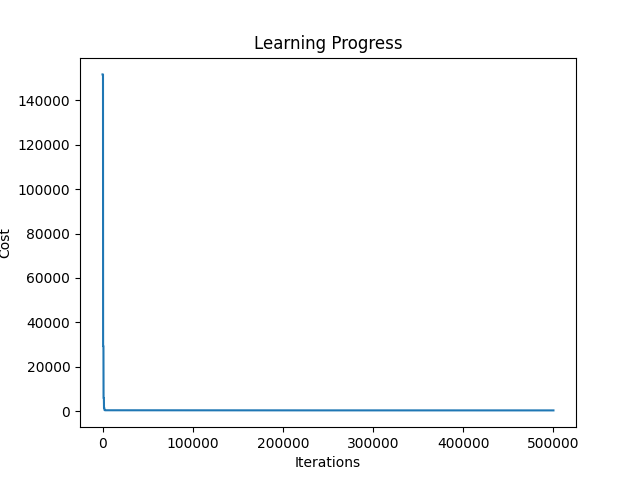

🍦 Ice Cream Revenue Prediction (Linear Regression)

📌 Overview

This project demonstrates how to build a Linear Regression model from scratch to predict ice cream revenue based on temperature.

No machine learning libraries like scikit-learn were used - everything was implemented manually to understand how it works under the hood.

Visualization

Scatter Plot (Data)

Fitted Line

Add your regression line plot here

Cost vs Iterations

⚙️ Features
Built Linear Regression from scratch
Implemented Gradient Descent manually
Visualized learning using cost function
Debugged real ML issues (shapes, convergence, plotting)
🧠 What I Learned
How models actually learn (not just using libraries)
How Gradient Descent updates parameters
Why learning rate matters

🛠️ Tech Stack
Python
NumPy
Pandas
Matplotlib
💡 Future Improvements
Add evaluation metrics (MAE, R²)
Try multiple features
Compare with Scikit-learn
Deploy as a web app🍦 Ice Cream Revenue Prediction (Linear Regression)
